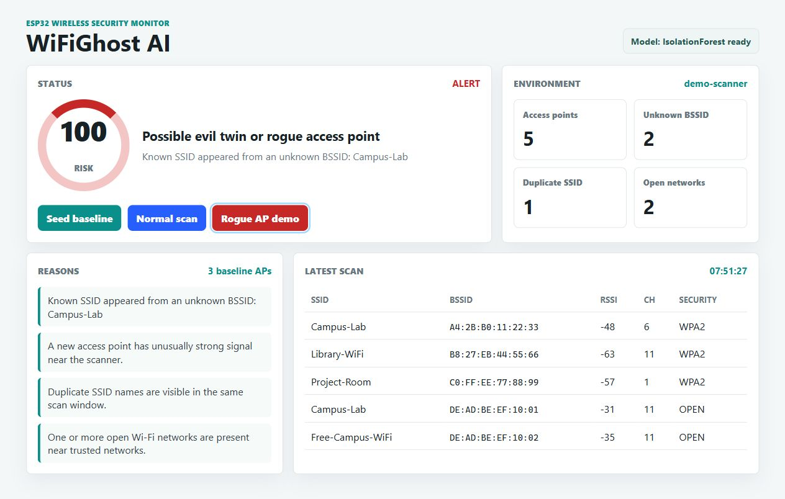

# WiFiGhost AI

ML-based rogue access point detection using an ESP32 Wi-Fi scanner, TFT display, and a Python dashboard.

## What it does

WiFiGhost AI watches the nearby Wi-Fi environment and raises an alert when it sees suspicious changes such as:

- a trusted SSID appearing from a new BSSID/MAC address
- duplicate SSID names that look like an evil twin
- a new open hotspot with unusually strong signal
- many unknown access points appearing at once
- abnormal Wi-Fi scan features detected by an Isolation Forest model

The ESP32 collects real Wi-Fi scans and shows the risk state on the TFT. The laptop runs the ML detector and dashboard.

## Hardware I recommend from your photo

Use the **right-side 2.8 inch TFT SPI 240x320 module**.

Reason: it exposes normal SPI pins like `SCK`, `SDI`, `SDO`, `CS`, `D/C`, and `RESET`, so it is practical with ESP32. The left red Arduino shield is designed for Arduino Uno-style parallel wiring and is harder to finish quickly with ESP32.

## Fast demo path

This works even before wiring the ESP32.

```powershell
cd "C:\Users\jeeva\Documents\New project\WiFiGhost-AI"
python -m venv .venv
.\.venv\Scripts\Activate.ps1
pip install -r requirements.txt
python scripts\train_model.py
python backend\app.py
```

Open:

```text
http://127.0.0.1:5000
```

Click:

1. `Seed baseline`
2. `Normal scan`
3. `Rogue AP demo`

For a live attack-style demo, turn on your phone hotspot near the ESP32 after the baseline is saved. Present it as a defensive simulated rogue AP event.

## Dashboard preview



## ESP32 firmware setup

Arduino IDE libraries:

- ESP32 board package
- Adafruit GFX Library
- Adafruit ILI9341

Copy:

```text
firmware/wifighost_esp32/secrets_example.h
```

to:

```text
firmware/wifighost_esp32/secrets.h
```

Edit `secrets.h`:

```cpp
const char* WIFI_SSID = "your-wifi-name";
const char* WIFI_PASSWORD = "your-wifi-password";
const char* API_URL = "http://YOUR_LAPTOP_IP:5000/api/scan";
```

Important: do not use `127.0.0.1` in the ESP32 firmware. Use your laptop IP address on the same Wi-Fi network.

## TFT wiring

For the 2.8 inch SPI TFT:

| TFT pin | ESP32 pin |
| --- | --- |
| VCC | 3V3 |
| GND | GND |
| CS | GPIO5 / D5 |
| RESET | GPIO22 / D22 |
| D/C | GPIO21 / D21 |
| SDI / MOSI | GPIO23 / D23 |
| SCK | GPIO18 / D18 |
| SDO / MISO | GPIO19 / D19 |
| LED | 3V3 |

Touch pins are not needed for this version.

## Project architecture

```text
ESP32 Wi-Fi scanner
        |
        | HTTP JSON scan
        v
Flask API + Isolation Forest model
        |
        +--> Web dashboard
        |
        +--> Risk response to ESP32 TFT
```

## API scan format

```json
{
  "device_id": "esp32-devkit-v1",
  "networks": [
    {
      "ssid": "Campus-Lab",
      "bssid": "A4:2B:B0:11:22:33",
      "rssi": -49,
      "channel": 6,
      "encryption": "WPA2"
    }
  ]
}
```

## One-line project explanation

WiFiGhost AI is a cyber-physical IoT security prototype that uses an ESP32 to scan the wireless environment and an ML model to detect rogue access points, evil twin SSIDs, and abnormal Wi-Fi behavior.

## Viva points

- This is not a Wi-Fi hacking tool. It is a defensive monitoring system.
- The ML model learns normal Wi-Fi scan behavior and flags abnormal patterns.
- The cybersecurity threat model is rogue AP, evil twin, open hotspot bait, and sudden environment drift.
- ESP32 is used as the IoT edge scanner and TFT alert display.
- Flask dashboard gives a real-time SOC-style view for demonstration.
